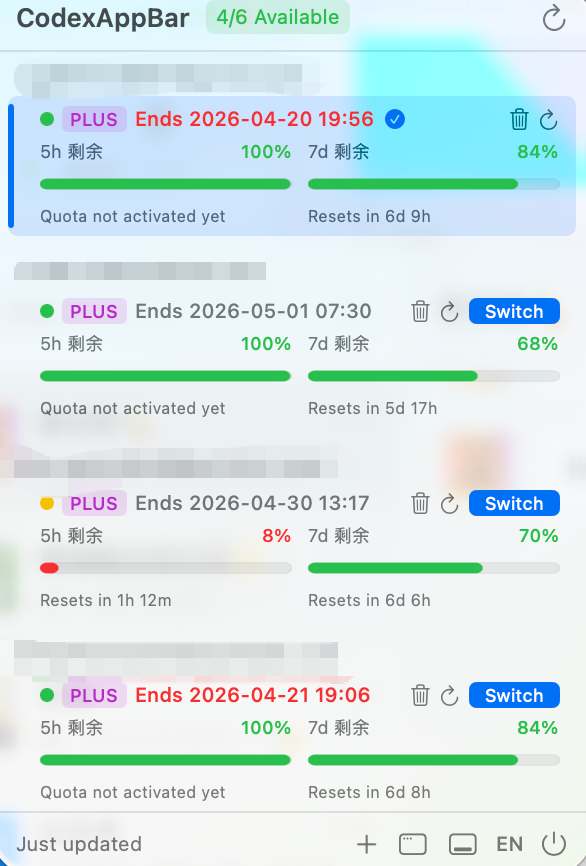
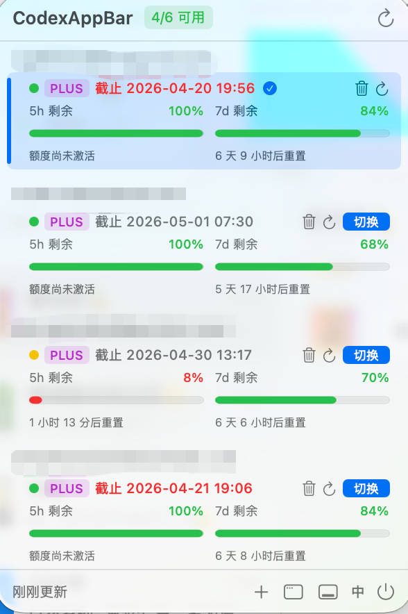

# CodexBar

> Public repository: [AI-xiaotiancai/codexbar-custom](https://github.com/AI-xiaotiancai/codexbar-custom)
>
> CodexBar is a custom public build for resilient menu bar recovery, remaining quota tracking, and subscription expiry visibility.
>
> This repository is based on [xmasdong/codexbar](https://github.com/xmasdong/codexbar) and continues as an independently maintained custom build with local fixes and UI improvements.
>
> 这是面向 GitHub 首页展示的公开版本，专注于菜单栏自愈、剩余额度展示和订阅到期提醒。
>
> 本仓库公开发布地址为 [AI-xiaotiancai/codexbar-custom](https://github.com/AI-xiaotiancai/codexbar-custom)。
>
> 本仓库基于 [xmasdong/codexbar](https://github.com/xmasdong/codexbar) 继续演进，作为带本地修复和界面改进的独立维护版本发布。

A macOS menu bar app for managing multiple ChatGPT/Codex accounts. Switch accounts instantly, monitor remaining quota, and keep the menu bar icon alive without opening a browser.

### v1.1.0 Release Highlights

- Menu bar self-healing with delayed recovery, forced rebuild, and periodic health checks
- Dock and menu bar can coexist, with a manual restore action from the main window
- 5h / 7d quota now shows remaining percentages, reset hints, and inactive-window handling
- Subscription expiry is shown inline with urgency colors
- Public release includes upstream attribution and a changelog

> **中文说明见下方 / Chinese version below**

---



## Features

- **Multi-account management** — Add unlimited ChatGPT accounts via OAuth
- **Remaining quota monitoring** — Tracks both the 5-hour rolling window and the 7-day quota as remaining percentage, with reset countdowns when available
- **Account switching** *(experimental)* — Writes the selected account to `~/.codex/auth.json`; requires quitting Codex.app to take effect. If using subagents, prefer logging out from within Codex.app instead
- **Auto refresh** — Active account refreshes every 10 seconds while the menu is open; all accounts refresh every 5 minutes in the background
- **Subscription visibility** — Shows each account's plan tier and exact subscription expiry timestamp, with warning colors inside 7 days / 3 days
- **Stable menu bar presence** — Uses a dedicated AppKit `NSStatusItem`, supports Dock + menu bar at the same time, and includes automatic menu bar recovery when macOS drops the icon
- **Status indicators** — Color-coded badges and menu bar icon reflect account health (normal / warning / quota exhausted / suspended)
- **Animated UI** — Progress bars and percentages animate on update

## Requirements

- macOS 13 Ventura or later
- [Codex](https://github.com/openai/codex) desktop app installed at `/Applications/Codex.app`

## Installation

1. Clone the repository:
   ```sh
   git clone https://github.com/AI-xiaotiancai/codexbar-custom.git
   ```
2. Open `codexBar.xcodeproj` in Xcode 15+
3. Select your development team in **Signing & Capabilities**
4. Build and run (`⌘R`)

## Usage

1. Launch CodexBar — it appears in the menu bar
2. Click **+** to add a ChatGPT account via OAuth
3. Click **切换 / Switch** on any account to activate it; CodexBar will confirm and then restart Codex.app
4. Account rows show:
   - 5h and 7d remaining percentages
   - reset countdowns, or `额度尚未激活` when a quota window has not started yet
   - exact subscription expiry time after the `PLUS` / `TEAM` badge
5. The menu bar icon reflects the active account's status:
   - `terminal.fill` — normal
   - `bolt.circle.fill` — quota nearing limit (≥ 80%)
   - `exclamationmark.triangle.fill` — weekly quota exhausted
   - `xmark.circle.fill` — account suspended
6. If the icon disappears from the menu bar, the app will rebuild it automatically during launch recovery, account switches, window activation, and periodic health checks. You can also trigger recovery manually from the main window.

## How it works

CodexBar uses the same OAuth client ID as the official Codex desktop app to authenticate with `auth.openai.com`. After login, tokens are stored locally in the app sandbox and the active account's tokens are written to `~/.codex/auth.json` for the Codex CLI/app to consume.

Usage data is fetched from the internal `chatgpt.com/backend-api/wham/usage` endpoint.

## Disclaimer

This project is **not affiliated with or endorsed by OpenAI**. It uses unofficial internal APIs that may change or break without notice. Use at your own risk. Do not use this tool to violate OpenAI's [Terms of Service](https://openai.com/policies/terms-of-use).

## License

[MIT](LICENSE)

---

## 中文说明



CodexBar 是一个 macOS 状态栏应用，用于管理多个 ChatGPT/Codex 账号，支持一键切换并实时监控剩余额度。

### v1.1.0 发布亮点

- 菜单栏图标自动恢复，支持延迟修复、强制重建和周期巡检
- Dock 和菜单栏可以同时存在，并提供主窗口里的手动恢复按钮
- 5h / 7d 额度改为展示剩余百分比、重置提示和未激活状态
- 订阅截止时间直接显示在套餐后面，并带紧急颜色提示
- 公开发布已补上来源仓库说明和变更记录

### 功能

- **多账号管理** — 通过 OAuth 添加任意数量的 ChatGPT 账号
- **剩余额度监控** — 以剩余百分比显示 5 小时窗口和 7 天窗口额度，并在可用时展示重置倒计时
- **账号切换**（实验性）— 将选中账号写入 `~/.codex/auth.json`，需退出 Codex.app 后生效。使用 subagent 时建议通过软件内退出登录功能切换账号
- **自动刷新** — 菜单打开时活跃账号每 10 秒刷新；后台每 5 分钟刷新所有账号
- **订阅信息可见** — 显示每个账号的套餐类型和精确到分钟的截止时间，7 天内橙色、3 天内红色提示
- **菜单栏更稳** — 使用独立的 AppKit `NSStatusItem`，支持 Dock 与菜单栏同时存在，并在图标被系统吞掉时自动恢复
- **状态指示** — 彩色徽章和状态栏图标直观反映账号状态（正常 / 即将用尽 / 额度耗尽 / 已停用）

### 系统要求

- macOS 13 Ventura 及以上
- 已安装 [Codex](https://github.com/openai/codex) 桌面版（位于 `/Applications/Codex.app`）

### 安装

1. 克隆本仓库：
   ```sh
   git clone https://github.com/AI-xiaotiancai/codexbar-custom.git
   ```
2. 用 Xcode 15+ 打开 `codexBar.xcodeproj`
3. 在 **Signing & Capabilities** 中选择你的开发者账号
4. 编译运行（`⌘R`）

### 使用说明

1. 启动 CodexBar 后，应用会常驻菜单栏，也可以在设置里保留 Dock 图标
2. 点击 `+` 通过 OAuth 添加账号
3. 在账号卡片里可查看：
   - `5h 剩余` 与 `7d 剩余`
   - 对应的重置倒计时；如果窗口尚未开始，会显示 `额度尚未激活`
   - `PLUS / TEAM` 后方的订阅截止时间
4. 点击 `切换` 可将目标账号写入 `~/.codex/auth.json`
5. 如果菜单栏图标偶发消失，应用会在启动、切号、窗口激活和周期巡检时自动恢复；主窗口里也提供了“恢复菜单栏图标”按钮

### 免责声明

本项目**与 OpenAI 无任何关联**，使用了非官方内部 API，可能随时失效。请勿用于违反 OpenAI 服务条款的行为，风险自担。
